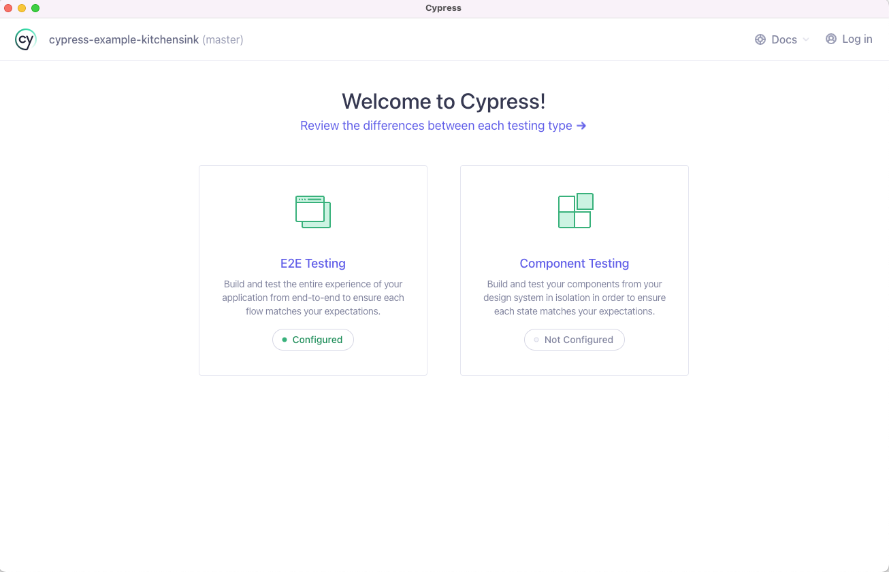
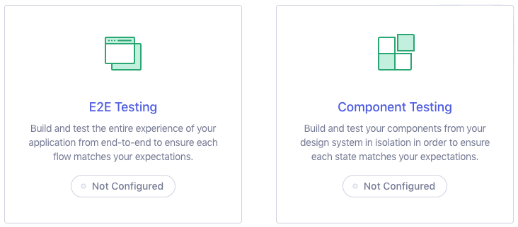
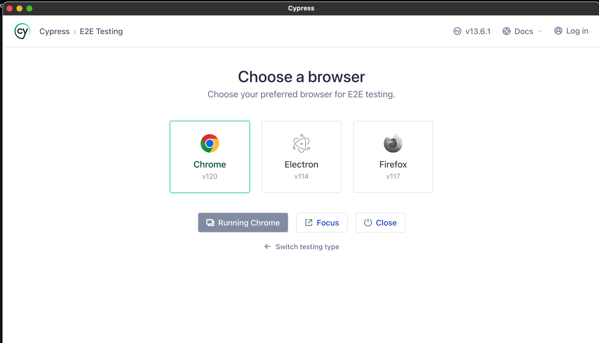
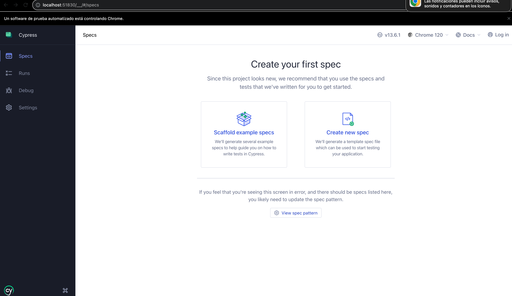
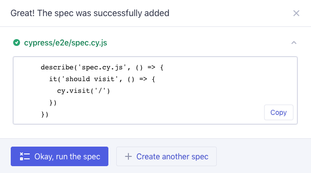

## Cypress
### First steps
* We need to install node:
* Creating a new empty project and execute this command via ´npm´:
 * npm install cypress --save-dev
* To open the Cypress App we need to execute this command:
 * npx cypress open
 
 ´npx´ is used as part of node, the Cypress Launchpad will open. Cuando es un proyecto nuevo, dentro del Launchpad nos aparece la opción de elegir el tipo de configuración que usaremos para nuestros test:

 * E2E Testing
 * Component Testing

 
* Add config files needed for each type of project 'cypress.config.js' and a folder 'cypress' with commands, support file for e2e and an example.
 

 * Se deberá elegir un navegador para poder empezar con las pruebas de e2e. Como defecto utilizaremos "Chrome"  
 
 * Luego de instalar correctamente y ejecutar Cypress, se empezará con crear una prueba nueva. Mediante "Create new spec"
 

 Si empezamos a utilizar la herramienta "Create new spec", se generará un archivo js, que servirá inicialmente para poder ingresar a la página de ejemplo:
 "https://example.cypress.io/"

### Plugins
1. ESLint: Plugin que se encarga de analizar código de JavaScript y encontrar rápidamente problemas. Se puede agregar como parte del pipeline en integración contínua.
>To Install
  * npm install eslint-plugin-cypress --save-dev
  * npm init @eslint/config
>To execute
 Para un solo archivo js
 * npx eslint project-dir/ file1.js
 Para un conjunto de archivos js
 * npx eslint project-dir/ file1.js

### Ejecución
 Como primera vez, se deberán descargar todas las dependencias de package.json mediante el comando:
> npm i
 Se ejecuta el proyecto ya configurado, mediante:
> En la ruta principal del proyecto:
 1. node scripts/cypress.js

### Reporting
1. Mocha Reporting
 To install mocha-foo-reporter:

> npm install mocha-foo-reporter --save-dev

 To use via ´mocha´
> mocha --reporter mocha-foo-reporter
2. JUnit
3. Multiple reports
> npm install --save-dev cypress-multi-reporters mocha-junit-reporter
> con mochawesome, tengo que ejecutar anter ´npx´:
> cypress run --reporter mochawesome \
 --reporter-options reportDir="cypress/results",overwrite=false,html=false,json=true
Se generará un archivo scripts/cypress.js
Y este se necesitará colocar en en ´package.json´
> node scripts/cypress.js
En esta sección se está configurando para la ejecución y creación del reporte.